<div align="center">

> 2026-10-01 classroom upgrade: the sole multi-device Edge and contract authority moved to `carbentra-campus-platform/edge` and `packages/iot-contract`. This repository owns Plug hardware, firmware and physical qualification facts. New local ON uses the same commissioning/load/feedback/dwell guards; actual presses establish a15-minute manual hold. The default target still disables actuation. Historical broker/PDF evidence does not automatically validate upgraded shared sources.

# CARBENTRA Plug

### 面向校园能源编排的 AIoT 边缘智能插座

**让普通用电设备拥有可感知、可判断、可执行、可验证的能源接口。**

[English](README_EN.md) ·
[机械工程](mechanical/rev_b/) ·
[电气工程](electronics/rev_b/integrated/) ·
[固件](firmware/) ·
[边缘服务](edge/) ·
[发布证据](release/)

[](https://github.com/hicancan/carbentra-smart-plug/actions/workflows/digital-checks.yml)


</div>

本机数字验证与源码摘要见 [交付入口](release/START_HERE.md)。GitHub 徽章展示远端工作流状态；物理放行条件独立保留。

<p align="center">
  <a href="visuals/rev_b/renders/01_hero_ivory.png">
    
  </a>
</p>

<p align="center">
  <sub>CARBENTRA Plug Rev B · 本地数字验证快照 · 实物尚未验证</sub>
</p>

---

## 一只插座，让普通负载进入可编排能源系统

CARBENTRA Plug 是 CARBENTRA 产品体系的第一个设备终端。

它把传统电器接入一条完整的设备级闭环：

> **感知 → 校验 → 判断 → 执行 → 验证 → 回传**

电压、电流、功率、能量与温度构成设备状态；本地策略决定动作是否具备执行条件；输出反馈确认物理结果；边缘侧持久运输这些事实，平台统一完成资产绑定、预测、约束策略和能碳核算。

当一台设备接入 CARBENTRA Plug，它同时获得联网能力、可观测状态、受约束执行能力，以及一个能够被上层能源系统持续理解的数字接口。

### 四项核心能力

| 能力 | 设备侧职责 |
| --- | --- |
| **感知** | 采集电压、电流、功率、能量、板温与输出状态 |
| **保护** | 本地故障、负载档案、命令时效、序列和物理边界共同参与决策 |
| **执行** | 在本地许可通过后完成受控开关动作 |
| **验证** | 独立读取输出侧状态，把真实结果送回下一轮控制 |

**云端负责全局智能，设备守住物理边界。**

---

## 产品一览

| 项目 | Rev B 数字工程基线 |
| --- | --- |
| 产品名称 | **CARBENTRA Plug** |
| 工程型号 | **CARBENTRA-P16-EVT-B** |
| 名义外形 | **108 × 93 × 65 mm** |
| 主 PCB | **100 × 85 mm，四层** |
| 主控 | **ESP32-C3-WROOM-02U** |
| 电能计量 | **ATM90E26 + 隔离 SPI + 1 mΩ 四端分流器** |
| 机械系统 | **71 个物理机械零件** |
| 主板电气项 | **101 个电气项 + 4 个安装位** |
| 网络链路 | **Wi-Fi + MQTT 双向 TLS** 参考实现 |
| 目标接口 | **单路 220 VAC / 16 A 级设计目标** |
| 当前阶段 | **Rev B 数字工程完成，进入实物 EVT（工程验证样机）前验证阶段** |

<p align="center">
  <a href="visuals/rev_b/renders/02_hero_detail.png">
    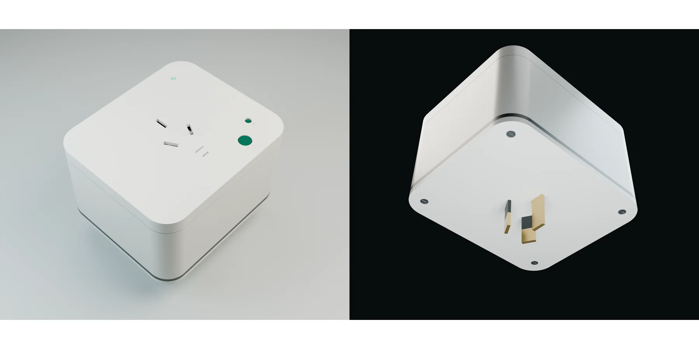
  </a>
</p>

外壳、插孔、后部插脚、本地按钮、状态指示、主板空间、保护器件与温度拾取结构都建立在同一套工程坐标系中，并贯通 FreeCAD、KiCad、Blender 与系统装配导出。

---

# 01 · 机械系统 — 让产品在真实空间里成立

Rev B 机械工程覆盖插接结构、保护门、L/N/PE 导电路径、保险与热保护安装、PCB、远端温度拾取、后部插脚和外壳装配。

## 六视图

<a href="visuals/rev_b/renders/07_six_view_sheet.png">
  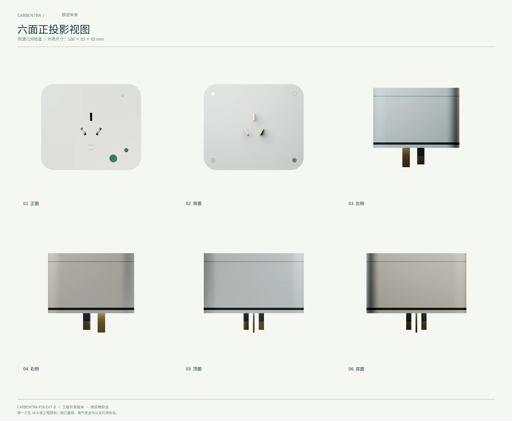
</a>

六视图给出产品的完整外形关系。当前工程同时提供可编辑 FreeCAD 源、STEP 总装、独立零件、公共坐标系网格、装配边界和机构检查记录。

## 爆炸结构

<a href="visuals/rev_b/renders/06_exploded_annotated.png">
  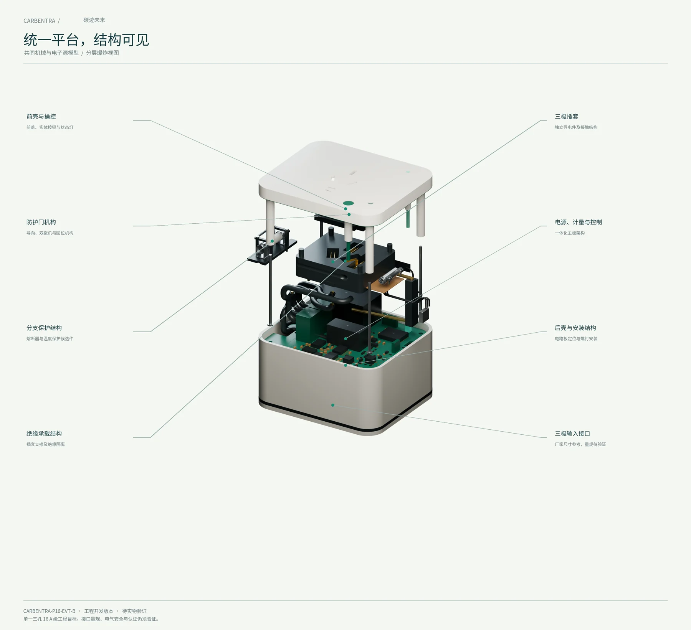
</a>

从外到内依次可以看到：

- 前后壳体与装配结构；
- 插孔保护门与接触机构；
- L / N / PE 导电路径；
- 保险与热保护部件；
- 四层主 PCB；
- 远端温度拾取头；
- 后部插脚与内部端接。

### 6 秒爆炸动画

<a href="visuals/rev_b/animation/carbentra_exploded.mp4">
  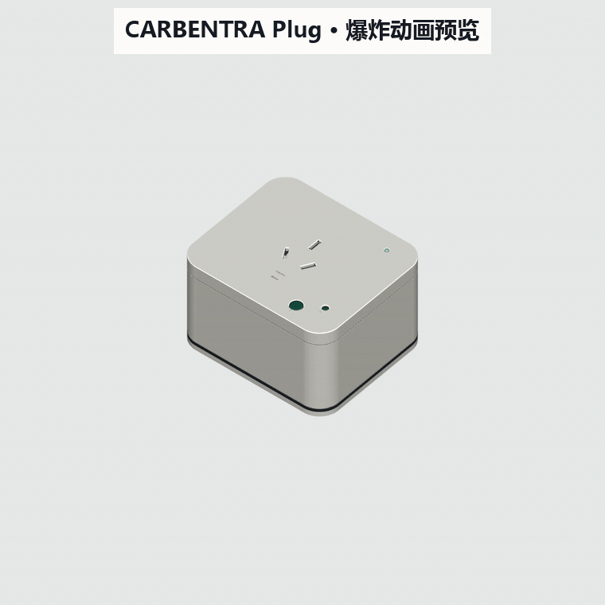
</a>

<p align="center"><sub>点击动画预览可打开原始 MP4。</sub></p>

## 剖视图

<a href="visuals/rev_b/renders/08_section_annotated.png">
  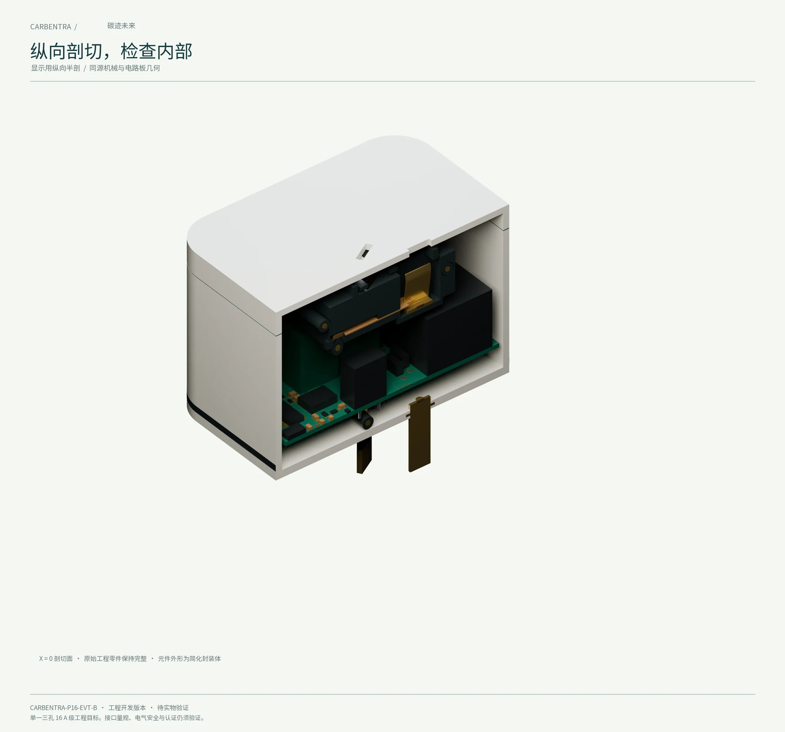
</a>

剖视图展示机械插接结构、电源路径、主板、保护器件与感知部件在封闭体积中的真实相对关系，并与系统总装使用同一坐标基准。

工程源文件：

- [FreeCAD 系统总装](mechanical/rev_b/CARBENTRA-P16-EVT-B_system_assembly.FCStd)
- [机械 STEP](mechanical/rev_b/CARBENTRA-P16-EVT-B_mechanical.step)
- [详细系统 STEP](mechanical/rev_b/CARBENTRA-P16-EVT-B_system_detailed.step)
- [机械验证摘要](mechanical/rev_b/VALIDATION_SUMMARY.md)

---

# 02 · 电气系统 — 把计量、控制、保护与反馈收进同一块主板

CARBENTRA Plug 的电气设计围绕一条明确主线展开：

> **测得准 · 隔得开 · 控得住 · 看得到结果 · 故障时保留本地保护**

<p align="center">
  <a href="docs/assets/readme/cn/electrical-architecture.svg">
    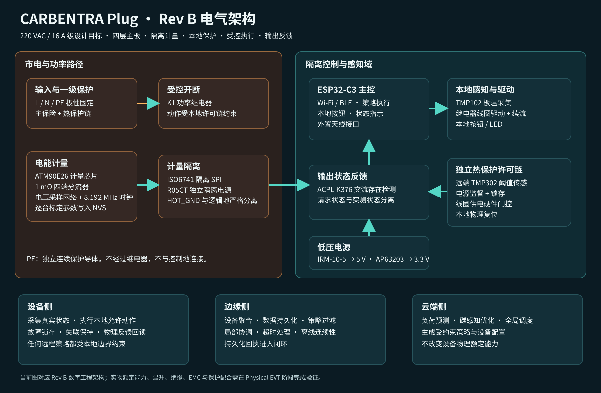
  </a>
</p>

Rev B 已经整合以下功能域：

- IRM-10-5 隔离 5 V 电源与 AP63203 3.3 V 逻辑电源；
- ESP32-C3 主控、编程接口、本地按钮、状态指示与外置天线接口；
- ATM90E26 电能计量链路、1 mΩ 四端分流器与隔离 SPI；
- 输出侧 AC presence 独立反馈；
- 远端 TMP302 温度阈值链路、锁存与本地物理复位；
- 主保险、热保护、继电器与输出路径；
- 连续 PE 保护导体路径。

## 原理图

<a href="electronics/rev_b/integrated/exports/schematic.pdf">
  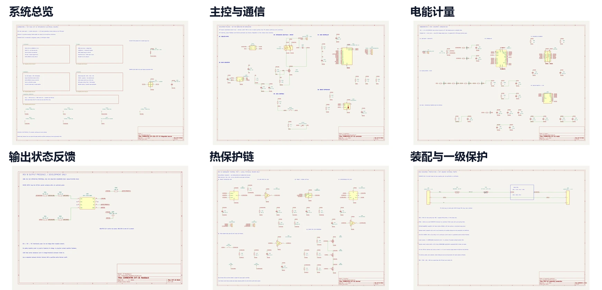
</a>

**点击上图打开完整原理图 PDF。**

README 总览采用中文功能页名称；元件位号、网络名与工程信号名保留 KiCad 原始命名，方便直接对应设计源文件。

六个功能页面：

[系统总览](electronics/rev_b/integrated/exports/integrated.svg) ·
[主控与通信](electronics/rev_b/integrated/exports/integrated-1%20controller.svg) ·
[电能计量](electronics/rev_b/integrated/exports/integrated-2%20meter.svg) ·
[输出状态反馈](electronics/rev_b/integrated/exports/integrated-3%20feedback.svg) ·
[热保护链](electronics/rev_b/integrated/exports/integrated-4%20thermal.svg) ·
[装配与一级保护](electronics/rev_b/integrated/exports/integrated-5%20assembly%20protection.svg)

KiCad 原生工程：

[`electronics/rev_b/integrated/`](electronics/rev_b/integrated/)

## 四层 PCB

Rev B 主板采用 **100 × 85 mm 四层设计**。当前数字检查记录：

- DRC 违规：**0**
- 未连接项：**0**
- 封装错误：**0**
- ERC 错误 / 警告：**0 / 0**
- 原理图—PCB 独立引脚键对照：**321 / 321 一致**

<a href="electronics/rev_b/integrated/exports/copper_review.pdf">
  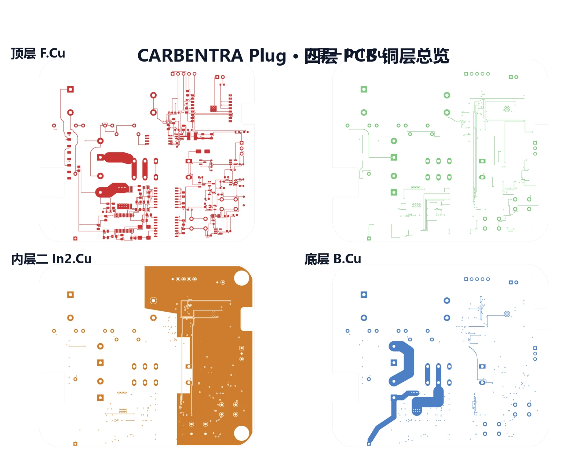
</a>

上图按照 **顶层 F.Cu / 内层一 In1.Cu / 内层二 In2.Cu / 底层 B.Cu** 展示当前铜层。点击可打开完整铜层审阅 PDF。

## PCB 装配

<a href="visuals/rev_b/renders/09_pcb_annotated.png">
  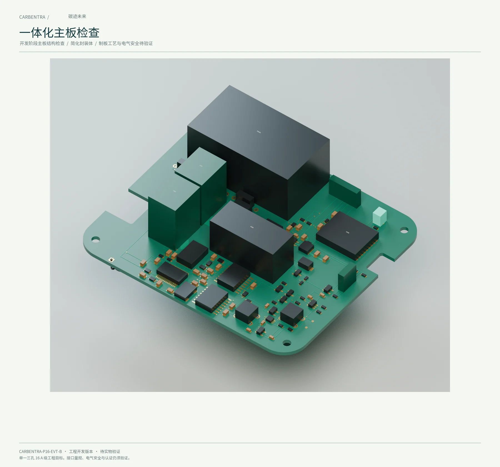
</a>

PCB 视觉装配直接由当前 ECAD 导出进入机械总装与 Blender 展示场景，实现原理图、PCB、机械结构和视觉资产之间的连续追踪。

进一步查看：

- [KiCad 原生工程](electronics/rev_b/integrated/integrated.kicad_pro)
- [电气 BOM](electronics/rev_b/integrated/electrical_bom.csv)
- [电气设计定义](electronics/rev_b/integrated/ELECTRICAL_SOURCE.md)
- [功率与电流复核](electronics/rev_b/integrated/POWER_CURRENT_REVIEW.md)
- [最终电气验证摘要](electronics/rev_b/integrated/validation/final_summary.json)

---

# 03 · 固件控制 — 把每一次物理动作放进本地安全上下文

CARBENTRA Plug 会在设备端重新判断每一条控制请求。

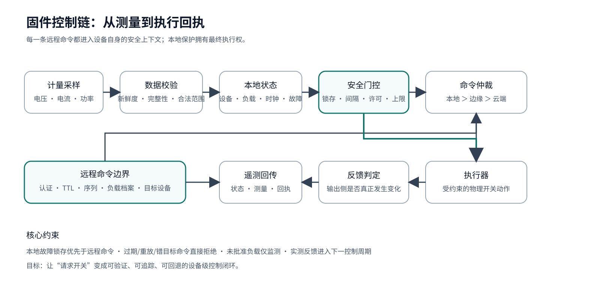

控制链依次检查：

- 设备身份与目标；
- 命令时间边界与 TTL；
- 命令序列与重放；
- 当前负载档案；
- 本地故障锁存；
- 计量数据有效性；
- 动作间隔与当前物理状态；
- 输出反馈与请求状态的一致性。

### 三条核心原则

1. **本地安全拥有最高执行优先级。**
2. **过期、重放、错目标和异常格式命令直接拒绝。**
3. **未知或未批准负载进入仅监测状态。**

当前固件代码已经覆盖：

- C 策略核心；
- ATM90E26 采集与完整性检查；
- TMP102 板温采集；
- AC presence 边沿反馈；
- Wi-Fi 重连；
- BLE 安全配网路径；
- MQTT 双向 TLS；
- retained 消息、分片、长度、类型与重复键边界检查；
- NVS 持久命令序号；
- 有界 RAM 遥测缓冲；
- 边缘侧持久化回执语义。

## 可复现软件检查

```powershell
uv venv --python 3.12
uv sync --locked
$env:CARBENTRA_PLATFORM_ROOT='D:\code\github\hicancan\carbentra-suite\carbentra-campus-platform'
pwsh -NoProfile -File scripts/check_windows.ps1 -SwitchCommandTestBinary 'D:\Temp\switch_command_decoder.exe' -BuildTarget -CheckNativeCAD -RenderGPU
```

本机环境、原生 CAD 重建顺序与工具路径见 [Windows 开发说明](docs/WINDOWS_DEVELOPMENT.md)。

共享 Edge 的 release 检查还要求真实 Switch C 解码器门禁：Windows 通过
`-SwitchCommandTestBinary` 或环境变量 `CARBENTRA_SWITCH_COMMAND_TEST_BINARY`
传入外部已编译程序；Linux `run_development_checks.sh` 和完整 release 验证器
也要求同一环境变量。缺失时明确失败，不再只验证原有三个 Plug C 门禁。
编译入口是共享平台的 `edge/tests/c/switch_command_decoder.c`，链接 Switch 的
`firmware/core/switch_core.c`、`firmware/main/command_json.c` 与 SDK 固定版本
cJSON；该程序只解析命令行 JSON，退出码 0/1 分别表示接受/拒绝，没有设备或网络操作。

[本次固件复验](firmware/remediation-report.json)记录全新 ESP-IDF 5.4.3 目标构建、
host 安全回归和新增共享解码器门禁的传递检查。它不修改原有实物 HOLD 状态，
也不把历史 CAD/制造报告重新标为本次运行。

当前仓库已验证：

- 唯一 C 本地保护核心，**45** 个策略用例；
- 边缘发布门禁记录 OS 专属排除与互补验证，当前测试数量见 firmware/evidence/shared-edge-validation.json；
- **10,000** 次本地故障优先级不变量检查；
- 协议 / 计量复位 / 链路卡滞回归；
- 输出反馈判定测试；
- 已配置 GitHub Actions Windows 主机门禁和 ESP32-C3 目标构建；远端执行状态以 Actions 记录为准。

ESP32-C3 当前源码已使用官方 ESP-IDF 5.4.3 重新构建，默认继电器禁用、证书有效期校验启用；源码与产物摘要见 firmware/validation.json。真实硬件验证仍为 HOLD。

---

# 04 · 边缘协同 — 把设备事实沉淀成楼宇侧状态

设备把测量与执行结果交给边缘节点，边缘节点将它们组织成可以持续协调的楼宇侧状态。

共享平台仓库中的边缘服务提供：

- MQTT 设备适配；
- 允许清单与设备身份校验；
- SQLite WAL 持久化；
- 启动纪元 + 序号去重；
- 持久化回执；
- 控制回执保存；
- 带重试和冲突隔离的 HTTP outbox；
- 持久命令 inbox、租约、过期/重放守卫和独立物理放行门；
- 源摘要绑定的真实软件 broker / 平台联调。预测、调度和核算只有平台一份实现。

一条设备遥测在成功落库后返回持久化回执，由此可以清晰区分“消息已到达 MQTT 消息代理”和“数据已进入边缘状态库”。

[查看边缘参考服务](edge/README.md)

---

# 05 · 云边端协同 — 从一个设备节点扩展到一组可协调负载

当设备端的感知、执行和反馈闭环成立，多台 CARBENTRA Plug 就可以进入更高层的能源协调。

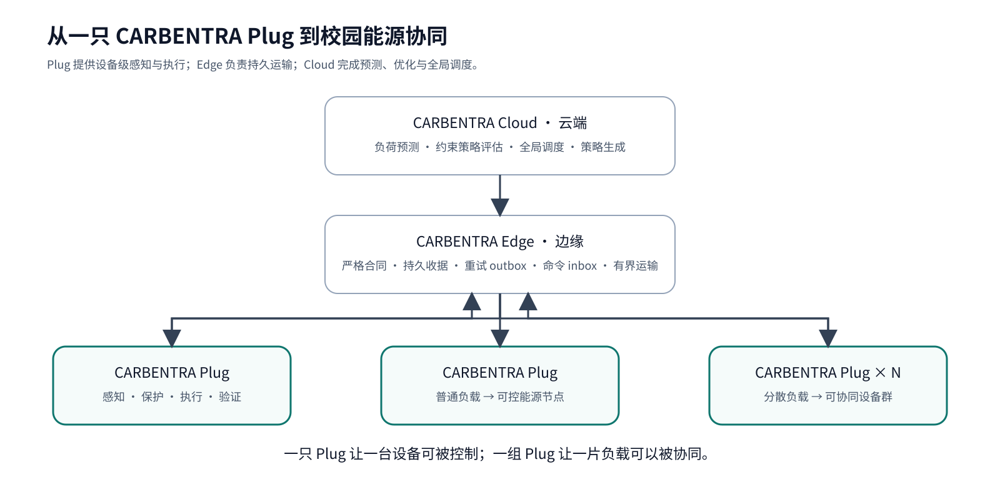

系统分工：

- **CARBENTRA Plug**：感知、保护、执行、验证；
- **CARBENTRA Edge**：合同校验、持久收据、重试运输、命令网关；
- **CARBENTRA Cloud**：负荷预测、约束策略评估、全局调度；
- **CARBENTRA Twin**：映射设备、空间、能耗、碳排与执行状态。

> **一只 Plug 让一台设备可被控制；一组 Plug 让一片负载可以被协同。**

CARBENTRA Plug 位于能源算法与真实物理设备之间，把调度策略落到最后一米，并把执行结果重新送回系统。

---

## 工程进度

| 领域 | 当前状态 |
| --- | --- |
| 产品定义 | ✅ CARBENTRA Plug Rev B 数字基线 |
| 机械 CAD | ✅ 原生 CAD + STEP + 装配 / 机构 / 连通性证据 |
| 电气设计 | ✅ 六页原理图 + 四层 PCB + ERC / DRC 数字检查 |
| 固件主机逻辑 | ✅ 策略、协议、反馈、计量回归测试 |
| 边缘参考服务 | ✅ 严格合同、持久运输、mTLS 虚拟设备闭环 |
| 视觉 / 数字孪生资产 | ✅ Blender、GLB、渲染、爆炸动画 |
| ESP32-C3 新版目标二进制 | ✅ 官方 ESP-IDF 5.4.3 当前源码实际构建，继电器禁用 |
| 实物 EVT（工程验证样机） | ⏳ 下一阶段 |
| 逐台计量标定 | ⏳ 实物阶段 |
| 16 A 温升 / 故障验证 | ⏳ 实物阶段 |
| 绝缘 / EMC / 浪涌 / 安规 | ⏳ 专业审查与试验阶段 |
| 校园现场闭环 | ⏳ EVT 与安全放行后进入 |

完整工程放行条件：

[`docs/ENGINEERING_RELEASE_GATES.md`](docs/ENGINEERING_RELEASE_GATES.md)

---

## 打开工程

### 机械工程

```text
mechanical/rev_b/
├── CARBENTRA-P16-EVT-B.FCStd
├── CARBENTRA-P16-EVT-B_mechanical.step
├── CARBENTRA-P16-EVT-B_system_assembly.FCStd
├── CARBENTRA-P16-EVT-B_system_assembly.step
├── CARBENTRA-P16-EVT-B_system_detailed.step
├── parts/
├── meshes/
└── validation reports...
```

### 电气工程

```text
electronics/rev_b/integrated/
├── integrated.kicad_pro
├── integrated.kicad_sch
├── integrated.kicad_pcb
├── electrical_bom.csv
├── electrical_manifest.json
├── exports/
└── validation/
```

### 固件与边缘服务

```text
firmware/
├── core/
├── main/
├── tests/
├── tools/
└── validation.json

edge/
├── README.md        # shared implementation: carbentra-campus-platform/edge
└── PROVENANCE.json  # migration record
```

### 视觉与数字孪生

```text
visuals/rev_b/
├── carbentra_studio.blend
├── carbentra_animation.blend
├── exports/
│   ├── carbentra_assembly.glb
│   └── carbentra_twin_light.glb
├── renders/
└── animation/
```

---

## 仓库结构

```text
carbentra-smart-plug/
├── mechanical/      # CAD、STEP、零件、机构与装配检查
├── electronics/     # KiCad 原理图、PCB、BOM、电气验证
├── firmware/        # ESP32-C3 源码、策略、计量、网络与主机测试
├── edge/            # 平台共享 Edge 的迁移说明与来源记录
├── visuals/         # Blender、渲染、GLB、动画
├── docs/            # 系统契约、品牌体系与平台叙事
├── tests/           # 策略参考测试
├── scripts/         # 验证与发布工具
└── release/         # 数字工程发布证据与审阅材料
```

按照工程审阅顺序阅读时，可以从 [`release/START_HERE.md`](release/START_HERE.md) 开始。

---

## 从数字工程走向实物 EVT

当前 Rev B 已经把机械、电气、固件、边缘服务和视觉资产收敛到同一套数字工程基线。下一阶段将把这些设计结论逐项落到实物验证：

- 目标市场对应的插头 / 插座标准确认；
- 实际爬电距离、空气间隙与绝缘结构审核；
- 外壳材料与异常工况验证；
- 预期故障电流与保护配合；
- 16 A 封闭温升与连接点发热试验；
- 插接量规、接触力、寿命、保持力与保护门验证；
- 不同负载类型的浪涌与继电器开断能力测试；
- 电压、电流、功率、能量逐台可溯源标定；
- 浪涌 / EFT / EMC / RF 集成测试；
- 生产级设备身份、安全启动、升级与密钥配置；
- 受控实物 EVT 与真实场景闭环验证。

> [!WARNING]
> **220 VAC / 16 A 级接口目前属于设计目标。实物额定能力、制造放行与产品合规将在上述验证完成后确定。**

---

## 项目与品牌

**CARBENTRA Plug** 是 CARBENTRA 产品体系中的首个设备终端。

```text
碳迹未来
└── CARBENTRA
    ├── CARBENTRA Plug      ← 本仓库
    ├── CARBENTRA Sense
    ├── CARBENTRA Edge
    ├── CARBENTRA Cloud
    └── CARBENTRA Twin
```

比赛 / 项目名称：

> **碳迹未来——基于 AIoT 云边端协同的高校智慧能碳管理平台**

平台英文描述：

> **CARBENTRA — AIoT Campus Energy Orchestration Platform**

完整平台叙事：

[**docs/PLATFORM_OVERVIEW.md**](docs/PLATFORM_OVERVIEW.md)

---

<div align="center">

# CARBENTRA Plug

### **Sense · Protect · Execute · Verify**

**让普通设备进入可编排的能源系统。**

[English README](README_EN.md)

</div>
