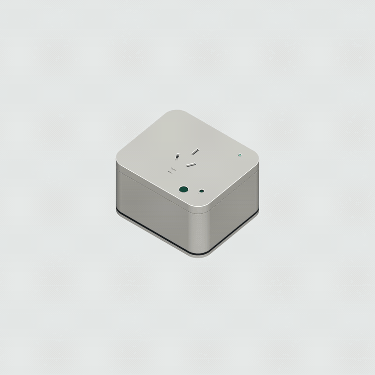
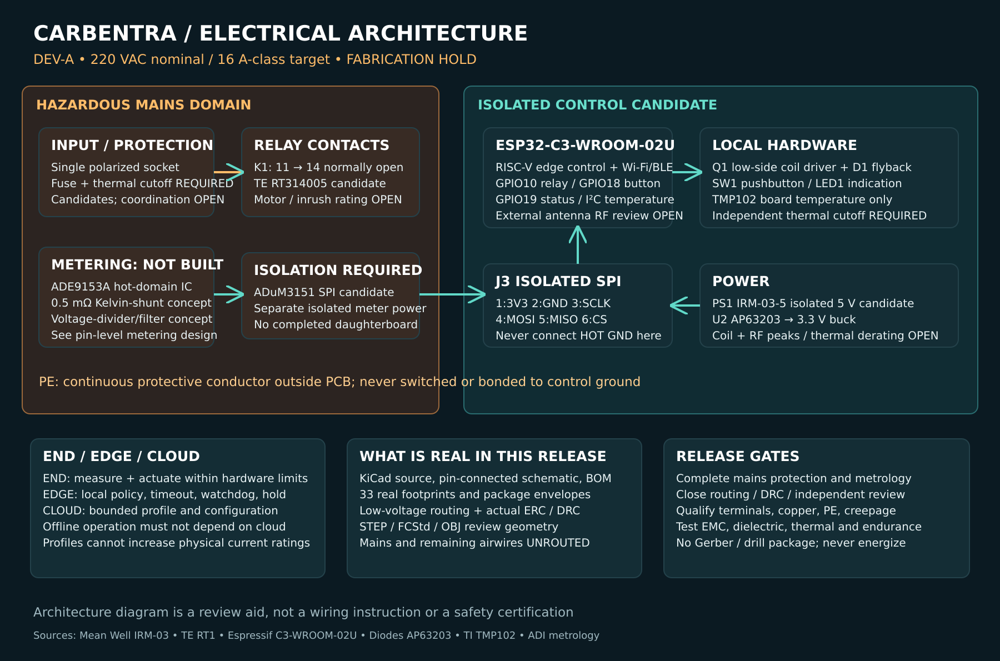
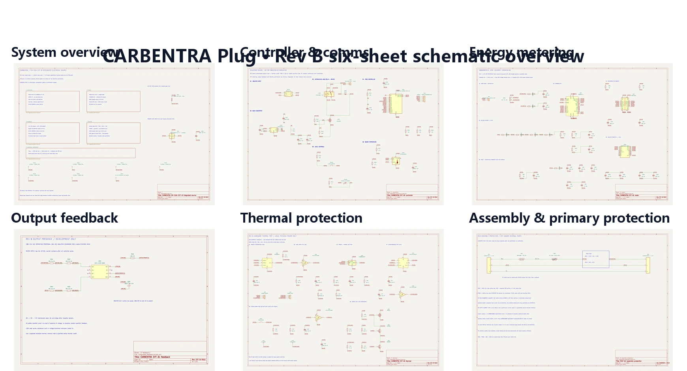
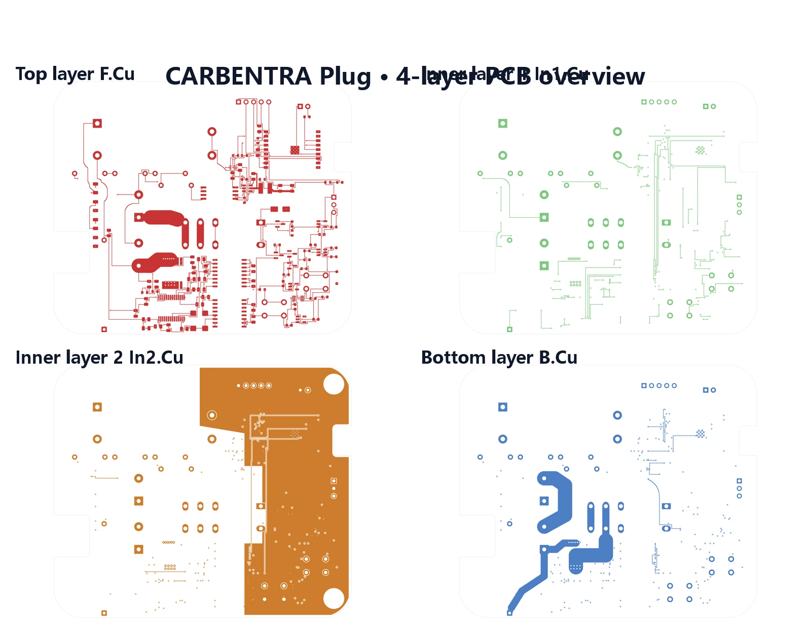
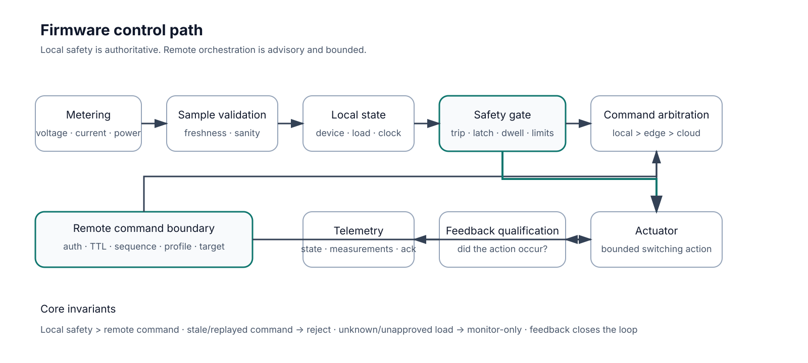
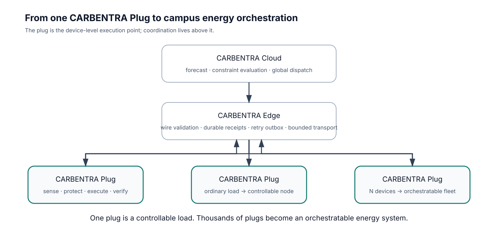

<div align="center">

> 2026-10-01 classroom upgrade: the sole multi-device Edge and contract authority moved to `carbentra-campus-platform/edge` and `packages/iot-contract`. This repository owns Plug hardware, firmware and physical qualification facts. New local ON uses the same commissioning/load/feedback/dwell guards; actual presses establish a15-minute manual hold. The default target still disables actuation. Historical broker/PDF evidence does not automatically validate upgraded shared sources.

[中文](README.md) · **English**

# CARBENTRA Plug

### AIoT Edge Smart Plug for Campus Energy Orchestration

**A digitally engineered smart plug that turns ordinary electrical loads into measurable, controllable, and orchestratable energy nodes.**

[](https://github.com/hicancan/carbentra-smart-plug/actions/workflows/digital-checks.yml)


[Mechanical](mechanical/rev_b/) · [Electronics](electronics/rev_b/integrated/) · [Firmware](firmware/) · [Edge](edge/) · [Release evidence](release/) · [Platform context](docs/PLATFORM_OVERVIEW.md)

</div>

Local digital validation and source digests are in [current delivery evidence](release/START_HERE.md). The GitHub badge shows remote workflow status; physical release gates remain separate.

<p align="center">
  <a href="visuals/rev_b/renders/01_hero_ivory.png">
    
  </a>
</p>

<p align="center">
  <sub>CARBENTRA Plug Rev B · digital engineering render · physical EVT and safety qualification are still pending</sub>
</p>

---

## From an ordinary load to an energy node

Most smart plugs stop at **remote switching + basic metering**.

CARBENTRA Plug is designed around a stricter closed loop:

> **sense → validate → decide → execute → verify → report**

The device measures the load, enforces local safety and command boundaries, executes only permitted actions, verifies whether the physical output actually changed, and then reports the measured result upstream.

That makes the plug useful not only as a standalone IoT device, but as the **device-level execution point** of a larger energy orchestration system.

### What is inside

- **Energy metering** — isolated measurement path around ATM90E26 and a 1 mΩ shunt.
- **Local control** — ESP32-C3-WROOM-02U, local button, status indication, secure network path.
- **Bounded actuation** — requested state is filtered through local safety, dwell, freshness, identity, and load-profile rules.
- **Physical feedback** — post-switch AC-presence feedback is treated as measured evidence, not assumed relay state.
- **Thermal / protection path** — independent thermal permission chain and fuse/protection components remain explicit engineering domains.
- **Edge integration** — MQTT, durable telemetry receipts, command sequencing, and durable platform transport.

> **Local safety is authoritative. Cloud intelligence never bypasses the device boundary.**

---

## Product at a glance

| Item | Rev B digital engineering baseline |
| --- | --- |
| Product | **CARBENTRA Plug** |
| Engineering ID | **CARBENTRA-P16-EVT-B** |
| Nominal enclosure | **108 × 93 × 65 mm** |
| Main PCB | **100 × 85 mm, 4-layer** |
| MCU | **ESP32-C3-WROOM-02U** |
| Metering | **ATM90E26 + isolated SPI + 1 mΩ shunt** |
| Mechanical model | **71 physical mechanical parts** |
| Main-board electrical items | **101 electrical items + 4 mounting footprints** |
| Network path | Wi-Fi + MQTT over mutual TLS reference implementation |
| Target interface | Single 220 VAC / 16 A-class design target |
| Current state | **Digital engineering baseline; physical EVT not yet qualified** |

<p align="center">
  <a href="visuals/rev_b/renders/02_hero_detail.png">
    
  </a>
</p>

The enclosure, receptacle, rear blades, local interface, internal board volume, protection elements, and sensing head are all modeled in a shared engineering coordinate frame. The design is original and is not presented as a reconstruction of any third-party product.

---

## Mechanical architecture

A product render can show appearance. The mechanical package has to answer harder questions:

- How do the receptacle, shutter, contacts, protection parts, PCB, sensing head, and rear interface coexist?
- Which interfaces are intentionally touching?
- Which volumes must remain separated?
- Can the same geometry be opened in native CAD and exported into the system assembly?

### Six-view package

<a href="visuals/rev_b/renders/07_six_view_sheet.png">
  
</a>

The current Rev B package includes editable FreeCAD sources, STEP exports, individual parts, common-frame meshes, fit reports, contact-engagement checks, shutter-state checks, polarity/connectivity checks, and insulation-domain review artifacts.

### Exploded architecture

<a href="visuals/rev_b/renders/06_exploded_annotated.png">
  
</a>

The exploded view separates the major physical domains: enclosure, shutter and receptacle mechanism, L/N/PE path, fuse and thermal elements, main PCB, remote sensing head, rear interface, and fastening structure.

### 6-second exploded animation

<a href="visuals/rev_b/animation/carbentra_exploded.mp4">
  
</a>

<p align="center"><sub>Click the animated preview to open the original MP4.</sub></p>

### Section view

<a href="visuals/rev_b/renders/08_section_annotated.png">
  
</a>

The section view closes the loop between “parts that exist” and “parts that actually fit inside the package.” Digital collision-free geometry is useful evidence, but it is **not** equivalent to tolerance-qualified manufacturing, creepage/clearance certification, thermal validation, or mechanical endurance.

**Native sources**

- [FreeCAD system assembly](mechanical/rev_b/CARBENTRA-P16-EVT-B_system_assembly.FCStd)
- [Mechanical STEP](mechanical/rev_b/CARBENTRA-P16-EVT-B_mechanical.step)
- [Detailed system STEP](mechanical/rev_b/CARBENTRA-P16-EVT-B_system_detailed.step)
- [Mechanical validation summary](mechanical/rev_b/VALIDATION_SUMMARY.md)

---

## Electrical architecture

The electrical design is structured so that metering, isolated logic, actuation, feedback, and protection remain distinguishable engineering domains instead of collapsing into “MCU + relay.”

<p align="center">
  <a href="electronics/exports/electrical_architecture.svg">
    
  </a>
</p>

Key implemented domains include:

- isolated 5 V supply and 3.3 V logic rail;
- ESP32-C3 control, programming, local button, status LED, and board-temperature sensing;
- ATM90E26 metering domain with isolation and explicit calibration requirements;
- post-switch AC-presence feedback;
- independent thermal permission / local rearm path;
- defined line path through fuse, thermal element, shunt, relay, and output;
- continuous unswitched PE path outside the PCB switching chain.

### Schematic — six functional sheets

<a href="electronics/rev_b/integrated/exports/schematic.pdf">
  
</a>

**Click the overview to open the full schematic PDF.** The native KiCad project is in [`electronics/rev_b/integrated/`](electronics/rev_b/integrated/).

Individual source sheets:

[Overview](electronics/rev_b/integrated/exports/integrated.svg) ·
[Controller](electronics/rev_b/integrated/exports/integrated-1%20controller.svg) ·
[Metering](electronics/rev_b/integrated/exports/integrated-2%20meter.svg) ·
[Feedback](electronics/rev_b/integrated/exports/integrated-3%20feedback.svg) ·
[Thermal](electronics/rev_b/integrated/exports/integrated-4%20thermal.svg) ·
[Assembly / protection](electronics/rev_b/integrated/exports/integrated-5%20assembly%20protection.svg)

### PCB — schematic to routed board

The Rev B main board is a **100 × 85 mm four-layer design**. The current digital evidence records zero native DRC violations, zero unconnected items, zero footprint errors, zero ERC errors/warnings, and an independent schematic-to-PCB pin comparison across all 321 numbered main-board pad keys.

<a href="electronics/rev_b/integrated/exports/copper_review.pdf">
  
</a>

The layout overview above shows the four copper layers. Click it to open the copper-review PDF; native copper remains authoritative in KiCad.

### PCB assembly

<a href="visuals/rev_b/renders/09_pcb_annotated.png">
  
</a>

The visual assembly is derived from the ECAD export rather than a separately invented board. The repository also includes:

- [Native KiCad project](electronics/rev_b/integrated/integrated.kicad_pro)
- [Electrical BOM](electronics/rev_b/integrated/electrical_bom.csv)
- [Electrical source definition](electronics/rev_b/integrated/ELECTRICAL_SOURCE.md)
- [Power-current review](electronics/rev_b/integrated/POWER_CURRENT_REVIEW.md)
- [Final electrical validation summary](electronics/rev_b/integrated/validation/final_summary.json)

---

## Firmware: local control before remote intelligence

CARBENTRA Plug does not interpret a remote command as permission to energize a load.

The firmware path validates device identity, time bounds, sequence, load profile, local fault state, metering validity, and actuation constraints before a request can become a physical action.



Three invariants define the control philosophy:

1. **Local safety outranks remote command.**
2. **Stale, replayed, malformed, or wrong-target commands are rejected.**
3. **Unknown or unapproved loads remain monitor-only.**

The current source includes:

- one canonical C local-safety policy core;
- ATM90E26 acquisition and integrity checks;
- TMP102 board-temperature acquisition;
- qualified AC-presence feedback capture;
- Wi-Fi reconnect logic;
- BLE provisioning path that requires real per-device verifier material;
- MQTT mutual TLS path with no plaintext fallback;
- retained-command rejection, bounded payload handling, and sequence persistence;
- RAM telemetry buffering plus edge-side durable receipt semantics.

### Reproducible software checks

```powershell
uv venv --python 3.12
uv sync --locked
$env:CARBENTRA_PLATFORM_ROOT='D:\code\github\hicancan\carbentra-suite\carbentra-campus-platform'
pwsh -NoProfile -File scripts/check_windows.ps1 -BuildTarget -CheckNativeCAD -RenderGPU
```

Windows runtime separation, native CAD rebuild and tool paths: [development guide](docs/WINDOWS_DEVELOPMENT.md).

Current host-side evidence includes:

- **45** canonical C safety-policy cases passing;
- edge release gates with explicit OS exclusions and complementary checks; current count in firmware/evidence/shared-edge-validation.json;
- **10,000** local-trip priority invariants passing;
- protocol / meter-reset / stuck-link regressions passing;
- feedback qualification tests passing.

The current ESP32-C3 source has been rebuilt with official ESP-IDF 5.4.3, actuation disabled and certificate-date checks enabled. Exact source and binary hashes are in firmware/validation.json. Physical verification remains HOLD.

---

## From one plug to CARBENTRA

This repository is product-first: **CARBENTRA Plug is the thing being engineered here.**

The wider CARBENTRA platform appears only after the device boundary is clear.



At system level:

- **CARBENTRA Plug** senses, protects, executes, and verifies.
- **CARBENTRA Edge** validates device contracts, persists receipts/outbox/inbox, and transports bounded commands under independent release gates.
- **CARBENTRA Cloud** performs forecasting, constraint evaluation, and global dispatch.
- **CARBENTRA Twin** can map devices, spaces, energy, carbon, policy, and execution state into a common operational view.

> **One plug is a controllable load. Thousands of plugs become an orchestratable energy system.**

The competition/project-level story — **碳迹未来——基于 AIoT 云边端协同的高校智慧能碳管理平台** — is documented separately in [Platform Overview](docs/PLATFORM_OVERVIEW.md). It is context for this product, not the subject of this README.

---

## Engineering status

| Domain | Current status |
| --- | --- |
| Product definition | ✅ CARBENTRA Plug Rev B frozen as current digital baseline |
| Mechanical CAD | ✅ Native CAD + STEP + fit / shutter / contact / connectivity evidence |
| Electrical design | ✅ Six-sheet schematic + routed 4-layer PCB + digital ERC/DRC evidence |
| Firmware host logic | ✅ Policy, protocol, feedback, and metering regressions passing |
| Edge reference service | ✅ Strict wire contract / durable transport / mTLS virtual-device integration |
| Visual / twin assets | ✅ Blender, GLB, renders, exploded animation |
| ESP32-C3 fresh target binary | ✅ Current-source official ESP-IDF 5.4.3 build, actuation disabled |
| Physical EVT prototype | ⏳ Not yet built and qualified |
| Meter calibration | ⏳ Requires traceable per-unit physical calibration |
| 16 A thermal / fault validation | ⏳ Physical test required |
| Insulation / EMC / surge / safety compliance | ⏳ Qualified engineering review and test required |
| Campus field deployment | ⏳ Not yet validated |

The canonical release boundary lives in [`docs/ENGINEERING_RELEASE_GATES.md`](docs/ENGINEERING_RELEASE_GATES.md).

---

## Open the engineering sources

### Mechanical

```text
mechanical/rev_b/
├── CARBENTRA-P16-EVT-B.FCStd
├── CARBENTRA-P16-EVT-B_mechanical.step
├── CARBENTRA-P16-EVT-B_system_assembly.FCStd
├── CARBENTRA-P16-EVT-B_system_assembly.step
├── CARBENTRA-P16-EVT-B_system_detailed.step
├── parts/
├── meshes/
└── validation reports...
```

### Electronics

```text
electronics/rev_b/integrated/
├── integrated.kicad_pro
├── integrated.kicad_sch
├── integrated.kicad_pcb
├── electrical_bom.csv
├── electrical_manifest.json
├── exports/
└── validation/
```

### Firmware / edge

```text
firmware/
├── core/
├── main/
├── tests/
├── tools/
└── validation.json

edge/
├── README.md        # shared implementation: carbentra-campus-platform/edge
└── PROVENANCE.json  # migration record
```

### Visual / digital twin

```text
visuals/rev_b/
├── carbentra_studio.blend
├── carbentra_animation.blend
├── exports/
│   ├── carbentra_assembly.glb
│   └── carbentra_twin_light.glb
├── renders/
└── animation/
```

---

## Repository map

```text
carbentra-smart-plug/
├── mechanical/      # CAD, STEP, parts, fit and mechanism evidence
├── electronics/     # KiCad schematic, PCB, BOM, exports, electrical checks
├── firmware/        # ESP32-C3 source, policy, metering, network, host tests
├── edge/            # migration provenance; implementation lives in campus-platform
├── visuals/         # Blender scenes, renders, GLB, animation
├── docs/            # product/system contracts, brand and platform context
├── tests/           # reference policy tests
├── scripts/         # validation and release helpers
└── release/         # frozen digital-development evidence and review outputs
```

For an audit-oriented reading order, start at [`release/START_HERE.md`](release/START_HERE.md).

---

## Safety and engineering boundary

> [!WARNING]
> **This repository is not a safety certification, manufacturing release, or authorization to energize a 220 V mains product.**
>
> The 220 VAC / 16 A-class interface is a **design target**, not a verified product rating. Digital CAD fit, ERC/DRC success, software tests, rendered assemblies, and nominal geometric separation do not establish safe real-world operation.

Before any physical deployment, the design still requires qualified work covering, at minimum:

- applicable plug/socket standard and market requirements;
- real creepage / clearance and dielectric construction;
- enclosure material and abnormal-operation behavior;
- fault-current and protection coordination;
- 16 A enclosed temperature rise and joint heating;
- contact force, gauge compliance, endurance, retention, and shutter behavior;
- relay switching duty for actual load classes and inrush;
- traceable voltage/current/power/energy calibration;
- surge / EFT / EMC / RF integration;
- secure production provisioning, update, and device identity;
- controlled physical EVT and field validation.

The repository intentionally keeps these open gates visible instead of turning digital evidence into a false claim of product readiness.

---

## Project context

**CARBENTRA Plug** is the first device product under **CARBENTRA**, the technology platform used by the project **碳迹未来**.

- Product: **CARBENTRA Plug**
- Platform: **CARBENTRA**
- Project: **碳迹未来**
- Project title: **碳迹未来——基于 AIoT 云边端协同的高校智慧能碳管理平台**
- English platform description: **AIoT Campus Energy Orchestration Platform**

Read the platform-level narrative in [`docs/PLATFORM_OVERVIEW.md`](docs/PLATFORM_OVERVIEW.md).

---

<div align="center">

### CARBENTRA Plug

**Sense · Protect · Execute · Verify**

*The device-level edge of an orchestratable energy system.*

</div>
