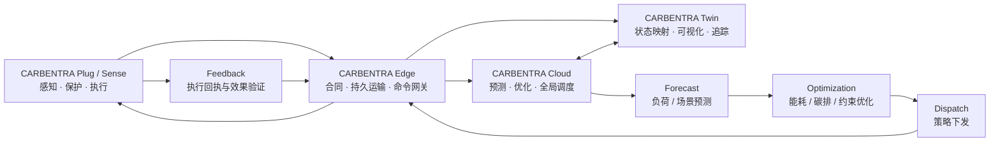

> [!NOTE]

> 2026-10-01 classroom upgrade: the sole multi-device Edge and contract authority moved to `carbentra-campus-platform/edge` and `packages/iot-contract`. This repository owns Plug hardware, firmware and physical qualification facts. New local ON uses the same commissioning/load/feedback/dwell guards; actual presses establish a15-minute manual hold. The default target still disables actuation. Historical broker/PDF evidence does not automatically validate upgraded shared sources.
> This document is the **platform / competition narrative** for **碳迹未来 · CARBENTRA**.
> The repository root README is intentionally product-first and documents **CARBENTRA Plug**.
> → [Back to CARBENTRA Plug](../README.md)

---

<div align="center">

# 碳迹未来 · CARBENTRA

### 基于 AIoT 云边端协同的高校智慧能碳管理平台

**CARBENTRA — AIoT Campus Energy Orchestration Platform**

[](https://github.com/hicancan/carbentra-smart-plug/actions/workflows/digital-checks.yml)


**Sense · Decide · Orchestrate · Act · Verify**

把校园里分散的负载，从“能看到”变成**可感知、可判断、可协同、可执行、可验证**的能源节点。

</div>

---

多数校园能耗系统止步于“采集 → 上云 → 看大屏”。

**碳迹未来**想继续往前走一步：如果每一个普通负载都能获得设备级感知能力、持久协议运输能力和受约束的执行能力，那么校园能源系统就不再只是被动记录能耗，而可以形成从预测、优化、调度到反馈验证的闭环。

**CARBENTRA** 是这套闭环背后的技术平台；**CARBENTRA Plug** 是它的第一个设备级终端。

> **The dashboard is not the destination. The closed loop is.**

## 从一个插座，到一套能源编排系统

CARBENTRA 不把“智能”理解成给插座加一个远程开关。设备只是闭环的最后一米。



这条链路对应四个层次：

- **Device**：测量真实设备状态，执行受约束动作，并始终让本地保护优先于云端策略。
- **Edge**：完成设备合同校验、持久收据、outbox / inbox、离线缓存和有界运输。
- **Cloud**：面向校园全局进行预测、优化和调度，不把设备安全边界交给远端算法。
- **Twin**：把设备、空间、能耗、碳排、策略与执行结果映射到同一可追踪视图中。

## 为什么叫 CARBENTRA

**碳迹未来**是项目与竞赛叙事；**CARBENTRA** 是可持续演进的技术平台品牌。

它不是某一个“智能插座”的名字，也不把系统锁死在碳核算、数字孪生或某一种校园场景。它承载的是一套可以继续扩展的云—边—端能源编排能力：

```text
碳迹未来
└── CARBENTRA
    ├── CARBENTRA Plug      设备级用能感知与执行终端
    ├── CARBENTRA Sense     环境 / 占用 / 状态感知节点
    ├── CARBENTRA Edge      楼宇设备协议与持久运输
    ├── CARBENTRA Cloud     预测、优化与全局调度
    └── CARBENTRA Twin      数字孪生与运行态势映射
```

当前仓库聚焦 **CARBENTRA Plug Rev B**，同时保留它接入 CARBENTRA Edge / Cloud / Twin 所需要的协议、能力模型与参考实现。

## 这不是一份概念图仓库

仓库把同一个设备从机械、电气、固件一路追到边缘服务和系统契约：

| 层 | 当前工程资产 | 入口 |
| --- | --- | --- |
| Mechanical | FreeCAD 参数化机械、STEP、零件与装配检查 | [`mechanical/`](../mechanical/) |
| Electronics | KiCad 原理图、PCB、BOM、规则与验证记录 | [`electronics/`](../electronics/) |
| Firmware | ESP32-C3 固件、策略/反馈/协议主机测试 | [`firmware/`](../firmware/) |
| Edge | MQTT / SQLite 持久运输、严格合同、平台 outbox / 命令 inbox | [`edge/`](../edge/) |
| System | 云边端架构、负载能力模型、网络与传感契约 | [`docs/system/`](../docs/system/) |
| Twin & Visuals | Blender 场景、GLB、六视图、剖切与爆炸动画 | [`visuals/`](../visuals/) |
| Release Evidence | 数字工程检查、交付边界与审阅材料 | [`release/`](../release/) |

**Rev B** 是当前主线；历史 Rev A 仅作为工程演进基线，不应与当前尺寸、检查结论或发布状态混用。

## 快速验证

软件侧检查不需要连接真实市电设备：

```bash
python3 -m venv .venv
. .venv/bin/activate
export CARBENTRA_PLATFORM_ROOT=/absolute/path/to/carbentra-campus-platform
pip install --require-hashes -r "$CARBENTRA_PLATFORM_ROOT/edge/requirements.lock"
pip install pytest==9.1.1
# Set MBEDTLS_INCLUDE and MBEDTLS_CRYPTO_LIBRARY to a reviewed host SDK library.
bash firmware/tests/run_development_checks.sh
python3 scripts/validate_firmware_evidence.py
python3 scripts/check_brand_hygiene.py
```

GitHub Actions 会在 push / pull request 时运行对应的数字开发检查。完整工程还包含机械、电气与可视化侧的验证记录；这些记录是**数字工程证据**，不是实物认证结论。

## 打开 Rev B 工程

- **FreeCAD**：`mechanical/rev_b/CARBENTRA-P16-EVT-B_system_assembly.FCStd`
- **Detailed STEP**：`mechanical/rev_b/CARBENTRA-P16-EVT-B_system_detailed.step`
- **KiCad**：`electronics/rev_b/integrated/integrated.kicad_pro`
- **Blender**：`visuals/rev_b/carbentra_studio.blend`
- **Lightweight Twin GLB**：`visuals/rev_b/exports/carbentra_twin_light.glb`
- **Exploded Animation**：`visuals/rev_b/animation/carbentra_exploded.mp4`

从交付审阅开始，可先看 [`release/START_HERE.md`](../release/START_HERE.md)。

## CARBENTRA Plug：设备侧真正负责什么

CARBENTRA Plug 的目标不是“猜出接上了什么电器然后随意控制”，而是把负载能力、控制权限、数据时效和安全约束显式化。设备侧只接受在本地能力边界内的动作；边缘负责持久运输；平台唯一负责预测、策略、账本和协调。

当前 Rev B 数字工程包含设备计量、执行反馈、热状态链路、网络时间与消息完整性约束、策略有效期与序列检查，以及面向失联和异常状态的 fail-safe 设计参考。具体实现与尚未闭环的问题以各子目录 README 和发布门禁为准。

## 能源闭环，而不是“碳排大屏”

CARBENTRA 的控制对象首先是 **Energy**：负载、功率、时序和设备状态；**Carbon** 则进入核算、评价和优化目标。

因此系统关注的是：

```text
Energy sensing
      ↓
State & data quality
      ↓
Forecast
      ↓
Carbon-aware / constraint-aware optimization
      ↓
Dispatch
      ↓
Local safety gate
      ↓
Physical execution
      ↓
Measured feedback
```

“节能”只有在执行结果被重新测量并进入下一轮优化后，才真正构成闭环。

## 当前状态

当前版本是 **CARBENTRA Plug Rev B 数字工程基线**。机械、电气、固件、边缘参考实现和视觉资产已经形成可检查的统一仓库，但实物 EVT、型式试验与现场闭环仍属于后续阶段。

接下来的主线是：实物样机 → 计量校准 → 温升 / 绝缘 / 保护 / EMC 验证 → 校园小规模接入 → 云边端闭环实验 → 量化节能与碳减排效果。

## Safety / Engineering boundary

> [!WARNING]
> **本仓库不是 220 V 市电产品的安全认证或生产放行文件。**
>
> 当前 `220 V AC / 16 A` 仅是设计目标与候选工程等级，尚未经过完整实物验证。任何市电接入、载流、温升、绝缘、异常工况、保护、EMC、校准和长期可靠性结论，都必须通过独立工程评审与合规测试获得。**不要把本仓库中的数字模型、仿真结果或开发固件直接作为通电依据。**

用户提供的视频与商品页面只用于外形和功能语境参考；CARBENTRA Plug 是独立工程设计，不宣称复原第三方产品内部结构。示例遥测与软件测试数据必须保持“模拟 / 测试”标记，不作为真实节能数据。

## Repository principles

这个仓库遵循三个简单原则：**安全边界先于智能策略，工程证据先于展示效果，真实反馈先于漂亮数字。**

如果 CARBENTRA 最终能够成立，它应该不是因为“做出了一个更酷的插座”，而是因为它证明了一件更重要的事：

> **校园中大量原本不可协同的普通负载，可以被组织成一个有边界、有反馈、可验证的能源系统。**

---

<div align="center">

**碳迹未来 · CARBENTRA**

*AIoT Campus Energy Orchestration Platform*

</div>
