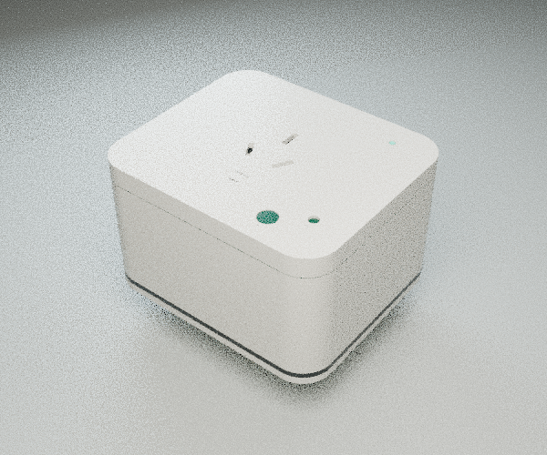

# Windows development

The tested native stack is PowerShell 7, Python 3.12.13 with uv, MSVC 2022,
ESP-IDF 5.4.3, KiCad 10.0.5, FreeCAD 1.1.4 and Blender 5.2.2 LTS.
Ordinary Python utilities use the root `.venv`; KiCad, FreeCAD and Blender use
their own native Python runtimes. Do not install `pcbnew`, `FreeCAD` or `bpy`
into the project environment. `scripts/engineering.ps1` configures each child
runtime and restores the caller's environment. FreeCAD calls KiCad through a
local JSON pipe because their native DLL versions are incompatible in-process.

```powershell
uv venv --python 3.12
uv sync --locked
$env:CARBENTRA_PLATFORM_ROOT='D:\code\github\hicancan\carbentra-suite\carbentra-campus-platform'
pwsh -NoProfile -File scripts/check_windows.ps1 -BuildTarget -CheckNativeCAD -RenderGPU
```

Install/sync the shared platform separately before crypto/integration tests.
`check_windows.ps1` always executes the real MSVC C host suites (AddressSanitizer)
and mbedTLS certificate/signature tests. `-BuildTarget` builds ESP32-C3 without
flashing. `-CheckNativeCAD` runs retained native geometry, connectivity, shutter,
clearance and ECAD negative controls. `-RenderGPU` renders the authored native
scene with OptiX/CUDA and exports its meshes to GLB; it fails if no GPU is found.
Run GPU work alone on an 8 GB device.

Default outputs go to `D:\Temp\codex\carbentra-localize-20261001\plug`.
Override `-OutputDirectory` when running independently; outputs are disposable.
Tool installations default to `D:\Dev\KiCad\10.0`, `D:\Dev\FreeCAD-1.1.4`,
`D:\Dev\esp-idf-v5.4.3` and `D:\Dev\esp-tools-v5.4.3`.
The engineering launcher accepts `-KiCadRoot`/`-FreeCADRoot` or
`CARBENTRA_KICAD_ROOT`/`CARBENTRA_FREECAD_ROOT`. Firmware build accepts
`-IdfRoot` and `-IdfToolsRoot`. Blender is resolved from PATH.

For a single native operation:

```powershell
pwsh -NoProfile -File scripts/engineering.ps1 -Runtime kicad -Script electronics/rev_b/integrated/scripts/audit_pcb_pins.py
pwsh -NoProfile -File scripts/engineering.ps1 -Runtime freecad -Script mechanical/rev_b/validate_integrated_fit.py
```

Rebuild in a separate copy of the tracked sources, never over the reviewed
canonical CAD. The generation order is `build_manifest.py`, `build_assembly.py`,
`build_schematic.py`, `build_pcb.py`, then `electronics/rev_b/scripts/replay_routing.py`
with the rebuilt PCB path. Mechanical generation is `build_base.py`, then
`export_release.py`; the board envelope exporter is
`electronics/rev_b/integrated/scripts/export_geometry.py --bodies-only`.
Run `scripts/verify_hardware_rebuild.py --rebuilt-root <copy>` through FreeCAD to
compare the separate rebuild with retained CAD. Embedded controller/meter/feedback/
thermal modules are build inputs and must remain in the repository.

```powershell
pwsh -NoProfile -File scripts/rebuild_windows.ps1
```

The verifier compares PCB pad geometry, nets, mask layers, copper and planes;
it compares FreeCAD solids with actual OCC bidirectional Boolean differences,
not only matching bounding boxes. Negative controls reject a 1 µm move and
removed material. Changing the OCC version can reorder BRep serialization or
duplicate-tail names without changing shape; those differences are recorded.

The published target remains actuation-disabled. Windows ASan is recorded as
ASan, not UBSan. Shared Edge POSIX permission tests run in the Linux platform
suite; Windows exclusions are named explicitly rather than reported as passes.
No physical MCU, RF, mains load, calibrated unit or manufacturing approval is
claimed by these checks.

The verified low-sample GPU frame is retained for inspection:



Local ignored backups/frames are excluded from publication. Their automatic disk
deletion was blocked by approval review. To inspect the exact saved cleanup list,
run the first command; the second explicitly applies deletion after validating
every file's size, SHA-256, checkout boundary and retained Git blob or rebuild inputs.
No directory wildcard is used. A changed candidate causes refusal.

```powershell
pwsh -NoProfile -File scripts/clean_local_outputs.ps1
pwsh -NoProfile -File scripts/clean_local_outputs.ps1 -Apply
```
