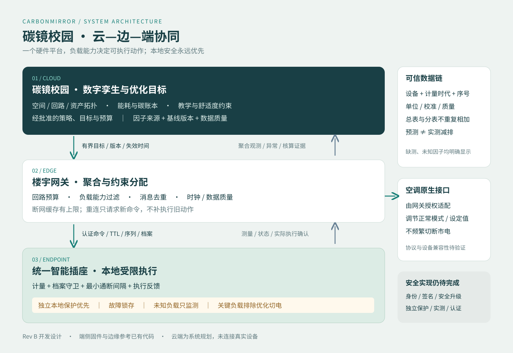

# 碳镜校园 · 统一智能自适应插座
## 系统工程说明 / Rev B 开发评审

**本包包括设计输入、可执行策略参考、已交叉编译的开发固件和经过单元测试的边缘服务。没有连接真实插座、部署云服务或取得计量/安全认证，不可直接用于市电试验或安全保护。** 所有示例遥测均为模拟，不能用于减碳成果申报。外形、结构、电路验证状态见对应专业目录。

## 一个平台，按能力约束适配

统一平台承担计量、设备身份、受限执行、本地保护接口与通信。差异通过版本化负载档案表达。识别候选仅用于人工审核，“识别了设备”不代表“获准控制”；设计要求未知、新接入或换负载时撤销旧控制档案并只监测。当前没有可靠自动换负载检测，实际换负载必须进入受控重新登记流程；不得假定固件已自动识别。插座不会为所有电器改变供电电压。

| 负载档案 | 优化入口 | 限制 |
|---|---|---|
| unknown | 测量、提示、人工确认 | 禁止节能自动断电与调压 |
| approved-switchable | 已批准的非关键待机设备，低频开关 | 明确授权、额定/浪涌验证、最小通断间隔 |
| hvac-normal-interface | 空调原生接口的模式/温度设定 | 不频繁切断空调市电；无接口只监测 |
| critical-monitor | 关键科研、医疗、网络、冷链等负载观测 | 排除节能自动切电，评估是否应接入可切换插座 |

关键负载免于节能切电，不等于免于电气安全保护。危险保护不得被云端、按钮或关键负载标志绕过；连续供电需求须另行设计。本方案不替代建筑断路器、保护接地或漏电保护。

## 云—边—端分工



- 云端：碳镜校园孪生资产、空间/电路拓扑、能碳核算、经批准的舒适度/教学约束、预测与目标、版本化策略。云端不覆盖本地保护阈值
- 边缘：按回路聚合、功率预算、能力过滤、缓存、时间与数据质量。数据失效停止优化，缺测不得按零计
- 端侧：测量、身份/档案/有效期/权限/序列检查、最小通断间隔、本地危险保护优先、实际执行结果。真实系统须有独立保护链和看门狗
- 原生设备接口：网关经授权接口调节空调正常模式，插座计量；协议兼容和执行确认另行验证，Python 不实现此路径

## 验收矩阵

遥测新鲜度 10 s、命令有效期上限 60 s、通断间隔 300 s 均为模拟器测试参数，不是已验证安全限值。量产必须根据负载厂家要求、风险分析与试验重新确定。

| ID | 要求 | 通过条件 | 当前证据 |
|---|---|---|---|
| R01 | 未知负载只监测 | unknown/unapproved 的 shed/restore 拒绝 | Python 通过 |
| R02 | 能力与权限检查 | 错设备/档案、未认证/授权、无能力拒绝 | Python 通过；认证为布尔桩 |
| R03 | 本地保护优先且锁存 | 离线、重复命令仍脱扣；远程不得解除 | Python 通过；硬件未试验 |
| R04 | 关键设备排除优化切电 | critical 拒绝自动开/关 | Python 通过 |
| R05 | 空调走正常接口 | 无市电开关能力拒绝 shed | Python 通过；原生接口未实现 |
| R06 | 禁止通用调压 | set_voltage 等动作拒绝 | Python 通过；电路另审 |
| R07 | 数据/时间有效 | 过期、未来、无效、陈旧数据拒绝 | Python/C 通过；固件可信时间区间已实现，实网待测 |
| R08 | 幂等防重放 | 重复不再执行，ID 冲突/旧序列拒绝 | Python/C 通过；固件 NVS 序号持久化已实现，真实掉电待测 |
| R09 | 离线确定行为 | 保持输出、本地保护继续、重连旧指令拒绝 | Python 通过 |
| R10 | 防频繁动作 | 低于最小通断时间拒绝状态变更 | Python 通过；继电器寿命未测 |
| R11 | 计量可追溯 | 单位、时间、序号、质量、校准/重启版本齐全 | JSON 示例；未标定 |
| R12 | 安全身份和更新 | 独立身份、最小权限、签名更新、防回滚与吊销 | mTLS/配网代码已实现；签名更新、防回滚与吊销服务未实现 |
| R13 | 电气/热/机械可靠性 | 额定/浪涌/温升/耐压/爬电/接地/阻燃/异常测试 | 专业与实验室验证，未通过 |
| R14 | 减碳可复核 | 基线、服务水平、干预、气象/占用、回弹、不确定度 | 核算规则，无实测成果 |

## 状态机及失败处理

```text
BOOT → MONITOR_ONLY（档案未知、换负载、配置不完整）
MONITOR_ONLY → READY_ON / READY_OFF（现场确认 + 批准档案 + 合法状态）
READY_ON ⇄ READY_OFF（授权新命令 + 能力 + 新鲜数据 + 最小间隔）
任意运行态 → OFFLINE_HOLD（断网；保持原输出，不执行远程命令）
OFFLINE_HOLD → 重新校验状态/档案/新命令（重连；不回放旧动作）
任意态 → FAULT_LATCHED（本地安全故障，危险保护优先）
FAULT_LATCHED → 人工检修/本地受控复位 → BOOT（禁止云端自动复位）
```

连接状态与输出状态正交，“离线”不代表“断电”。模拟器仅实现输出/故障锁存和命令守卫，未实现完整 BOOT、绑定和人工复位流程。掉电重启策略由危害分析决定，未经验证不得自动复电；关键业务不可依赖插座软件保证连续供电。

生产命令应绑定租户、设备、档案/策略版本、签发者、序列、唯一 ID、签发/失效时间及完整动作载荷。真实设备须实现认证通道、签名验证、可信时间、防回滚计数与持久幂等账本。**authenticated/authorized 布尔桩不是安全机制。** accepted 不代表物理执行成功；真实接点/功率反馈应区分 requested、accepted、applied、verified、failed。

断网保留本地测量、告警、有界缓存；恢复后先同步状态再请求新目标，不补执行旧命令。缓存满不能阻塞保护，需丢失标记与闪存磨损策略。日志不记录住户身份、不公开占用推断。

## 数字孪生对象映射

| 对象 | 模拟标识 | 关系与属性 |
|---|---|---|
| Campus | campus-demo | 园区边界、核算周期、时区 |
| Building → Room | building-A → room-301 | belongsTo；空间不含个人姓名 |
| Circuit | circuit-A3 | feeds Socket；总表计量点与额定配置 |
| Socket | CM-SIM-001 | locatedIn Room；measures Load；固件/档案版本 |
| Load | load-demo-001 | pluggedInto Socket；批准档案、关键等级 |
| MeterSeries | energy-import | 累计有功电量、序号、校准、质量 |
| Policy / Command | policy-demo-v1 / cmd-demo-001 | targets Socket；有效期、执行结果证据 |
| CarbonLedger | ledger-demo-period | derivedFrom MeterSeries + Factor + Boundary |

遥测见 telemetry.simulated.json；能力 schema 与实例见 load-capability.schema.json、load-profiles.simulated.json。区间电量须由同一 meter_epoch 两个有效累计读数求差。重启、回卷、换表不能制造负消耗或零消耗。瞬时功率不能冒充区间电量。

## 碳核算与效果边界

1. 明确外购电地点法及适用市场法，采用经验证因子。因子记录来源 URL、地区、年份、方法、单位、版本、有效范围和质量。示例不编造实时电网因子
2. 运行电耗估算排放 = 有效区间 kWh × 匹配地区/年份/方法的 kgCO₂e/kWh。计量边界中注明插座自耗是否覆盖；未测自耗单列。制造/运输/报废是独立生命周期边界
3. 校园以总表为盘查基础时，插座分表用于拆解诊断，不再叠加到总表。一个 kWh 只能有一个核算归属；未覆盖量、时钟差和计量误差单列；重传按设备、meter_epoch、序号去重
4. 优化前后差值不是天然节能证明。预先冻结基线模型、窗口、排除条件；控制气象、教学日历、占用、服务水平和新增设备；记录实际干预；计入恢复期回弹和设备自耗。不满足覆盖率、校准、可比性和不确定度要求时，仅报告“观测变化”
5. 预测节电、实测节电、归因减排、盘查排放分别显示；如实报告负效果。移峰不一定节电或减碳，低电价不等于低碳

## 放行门槛

- 样机前：电气评审、兼容矩阵、失效模式、适用安规与可制造性评审
- 受控试验前：隔离低压仿真、计量校准计划、真实签名、权限撤销及掉电恢复验证
- 校园试点前：实验室测试、现场安装评估、关键负载排除、授权名单、检修/人工旁路、安全评审
- 成果验收前：冻结边界、因子与基线，披露不确定度、失败案例、数据缺口与服务代价

## 官方参考及复现

守卫与参数是项目提出的设计要求，不表示以下机构认证。检索日期 2026-09-30：

- NISTIR 8259A：设备身份、配置、数据保护、接口控制、更新与安全状态能力框架，https://csrc.nist.gov/pubs/ir/8259/a/final
- GHG Protocol Scope 2 Guidance：外购电及地点法/市场法核算框架，https://ghgprotocol.org/scope-2-guidance
- GHG Protocol：盘查归属与干预影响应区分，https://ghgprotocol.org/blog/top-ten-questions-about-scope-2-guidance

运行：`python -m unittest discover -s tests/policy -v`。输出见 policy-test-log.txt。通过仅说明参考策略满足已定义断言，不证明硬件或完整系统可靠。

## 开发证据索引

本页中的 Python 模拟与 schema 验证仍保持参考用途。真实 C 固件实现见 firmware/，实际构建与 SHA-256 见 firmware/validation.json；边缘服务和24项测试见 edge/。纯策略通过不代表独立硬件保护、实机互通、计量或网络部署通过。发布门槛见 docs/ENGINEERING_RELEASE_GATES.md。
